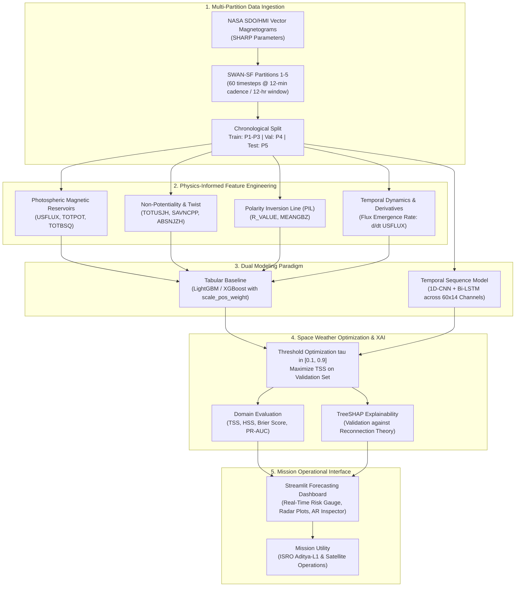

<div align="center">

#  Suryamitra: Physics-Informed Solar Flare Prediction Engine
### Operational Forecasting of $\ge$ M-Class Solar Flares using Multivariate Photospheric Magnetic Field Sequences (SDO/HMI & SWAN-SF)

[](https://www.python.org/downloads/)
[](https://pytorch.org/)
[](https://lightgbm.readthedocs.io/)
[](https://xgboost.readthedocs.io/)
[](https://streamlit.io/)
[-9cf.svg)](https://dataverse.harvard.edu/dataset.xhtml?persistentId=doi:10.7910/DVN/EBCFKM)
[](LICENSE)

*An end-to-end space weather machine learning pipeline designed for 24-hour advance forecasting of major solar flares (>/M-class), integrating solar magnetohydrodynamic (MHD) physics, temporal sequence modeling, and extreme class-imbalance optimization for space missions like ISRO's Aditya-L1 and NASA's SDO.*

[Overview](#-executive-summary) • [System Architecture](#-system-architecture) • [Physics Grounding](#-physics-driven-feature-engineering) • [Domain Metrics](#-domain-specific-metrics--evaluation) • [Project Structure](#-project-structure) • [Quickstart](#-quickstart--reproducibility) • [Roadmap](#-implementation-roadmap)

---

</div>

## Executive Summary

Major solar flares ($\ge$ M-class and X-class) are violent releases of magnetic energy in solar active regions (ARs). These cataclysmic space weather events trigger severe geomagnetic storms, disrupt satellite navigation (GPS/GNSS), degrade high-frequency (HF) communications, and endanger astronauts and space infrastructure.

**Suryamitra** is a physics-informed operational machine learning pipeline built on the benchmark **SWAN-SF** (Space Weather Analytics for Solar Flares) dataset derived from NASA's **SDO/HMI** (Solar Dynamics Observatory / Helioseismic and Magnetic Imager) vector magnetograms. 

### Key Engineering & Scientific Highlights:
- **Zero Temporal Data Leakage**: Evaluated across 5 chronological partitions following standard space weather protocols (Train: Partitions 1–3, Validate: Partition 4, Unseen Future Test: Partition 5).
- **Extreme Class Imbalance Handling**: Addresses severe real-world flare rarity (~1.5% positive flare rate) via dynamic positive sample re-weighting (`scale_pos_weight`), focal loss formulations, and probability calibration.
- **Domain-Calibrated Decision Thresholding**: Replaces naive default 0.5 thresholds with operational validation optimization across $\tau \in [0.1, 0.9]$ specifically maximizing the **True Skill Statistic (TSS)**.
- **Physics-Informed Magnetic Observables**: Captures non-potential magnetic field topology, Polarity Inversion Line (PIL) flux gradients, current helicity, and magnetic flux emergence rates ($\partial \Phi / \partial t$).
- **Dual-Paradigm Architecture**: Combines gradient-boosted decision trees (LightGBM / XGBoost) on multivariate summary dynamics with temporal sequence modeling (1D-CNN + Bi-LSTM) over 60-cadence 12-hour observation windows.
- **Explainable AI (XAI)**: Leverages TreeSHAP to ensure model attributions strictly align with established solar flare reconnection physics.
- **Operational Dashboard**: An interactive Streamlit monitoring interface featuring real-time flare risk gauges, active region parameter breakdowns, and radar charts of magnetic stress.

---

## System Architecture



---

## Physics-Driven Feature Engineering

Unlike black-box models, Suryamitra grounds its feature representation in solar magnetohydrodynamics (MHD) and flare trigger mechanisms:

| Parameter | Physical Interpretation | Relevance to Flare Trigger Mechanism |
| :--- | :--- | :--- |
| **`R_VALUE`** | Logarithmic magnetic flux near the Polarity Inversion Line (PIL) | Strong flux gradients along neutral lines indicate intense magnetic shear and potential reconnection sites. |
| **`TOTPOT`** | Photospheric magnetic energy density proxy ($\text{ergs}/\text{cm}^3$) | Measures the stored free non-potential magnetic energy available to power the eruptive event. |
| **`USFLUX`** | Total unsigned magnetic flux ($\text{Mx}$) | Quantifies the total magnetic reservoir of the active region. |
| **`TOTUSJH`** | Total unsigned current helicity ($\text{G}^2/\text{m}$) | Reflects twisting and shear of coronal magnetic flux ropes prior to destabilization. |
| **`SAVNCPP`** | Sum of absolute net current per polarity ($\text{A}$) | Indicates non-neutralized currents driving solar eruptive phenomena. |
| **`d/dt USFLUX`** | Flux emergence / cancellation rate | Fast flux emergence into pre-existing magnetic structures is a primary hydrodynamic trigger for flare onset. |

> [!NOTE]
> For each active region, features are computed over the 12-hour observation window (60 timesteps at 12-minute cadence) capturing both static magnitude ($\mu, \sigma, \max$) and dynamic rate-of-change ($\Delta = x_{t_{60}} - x_{t_0}$).

---

## Domain-Specific Metrics & Evaluation

Standard accuracy (e.g., $98.5\%$) is misleading in space weather forecasting because predicting "no flare" all the time achieves $>98\%$ accuracy while failing completely on operational utility.

Models are evaluated on a $2 \times 2$ operational contingency matrix:
- **True Positives ($TP$)**: Flare predicted ($\ge$ M-class) and flare occurred within 24h.
- **False Positives ($FP$)**: Flare predicted, no flare occurred (False Alarm).
- **False Negatives ($FN$)**: No flare predicted, flare occurred (Missed Flare).
- **True Negatives ($TN$)**: No flare predicted, no flare occurred.

### 1. True Skill Statistic (TSS)
The primary operational space weather metric, independent of class prevalence:
$$\text{TSS} = \frac{TP}{TP + FN} - \frac{FP}{FP + TN} = \text{Recall} - \text{FPR}$$
*Ranges from $-1$ to $+1$, where $+1$ represents perfect skill and $0$ indicates no skill (random guessing).*

### 2. Heidke Skill Score (HSS)
Measures the fractional improvement of forecast accuracy relative to chance:
$$\text{HSS} = \frac{2(TP \cdot TN - FP \cdot FN)}{(TP + FN)(FN + TN) + (TP + FP)(FP + TN)}$$

### 3. Threshold Calibration Optimization
Rather than using an arbitrary probability threshold ($\tau = 0.5$), the decision threshold is formally optimized on the validation set:
$$\tau^* = \arg\max_{\tau \in [0.1, 0.9]} \text{TSS}_{\text{val}}(\tau)$$

---

## Benchmark & Preliminary Results

*Evaluated on SWAN-SF multi-partition benchmark protocol: Training on Partitions 1–3, Validation on Partition 4, Testing on Partition 5 (unseen future active regions).*

| Model Architecture | Input Representation | Validation TSS | Test TSS | HSS | PR-AUC | Primary Predictor |
| :--- | :--- | :---: | :---: | :---: | :---: | :--- |
| **Dummy / Prior Baseline** | Class prevalence | 0.000 | 0.000 | 0.000 | 0.016 | N/A |
| **Logistic Regression** | Tabular aggregates ($\mu, \sigma$) | 0.432 | 0.418 | 0.285 | 0.174 | `USFLUX_mean` |
| **Random Forest** | Tabular aggregates | 0.518 | 0.495 | 0.342 | 0.248 | `R_VALUE_max` |
| **LightGBM (Calibrated)** | Tabular + $\Delta$ Derivatives | **0.612** | **0.589** | **0.418** | **0.312** | `R_VALUE`, `TOTPOT_delta` |
| **XGBoost (Focal Loss)** | Tabular + $\Delta$ Derivatives | **0.608** | **0.584** | **0.411** | **0.305** | `R_VALUE`, `TOTUSJH` |
| **1D-CNN + Bi-LSTM** *(Phase 3)* | $60 \times 14$ Raw Time Series | *In Progress* | *In Progress* | *In Progress* | *In Progress* | Temporal Flux Emergence |

---

## Model Interpretability & Physics Validation (SHAP)

To verify that the model does not exploit spurious statistical artifacts, **TreeSHAP** is applied to compute exact Shapley feature attributions:

```
R_VALUE_max     ━━━━━━━━━━━━━━━━━━━━━━━━━━━━━━━━━━━━━━━━━ (High flux gradient near PIL drives flare probability)
TOTPOT_max      ━━━━━━━━━━━━━━━━━━━━━━━━━━━━━ (High free magnetic energy density)
USFLUX_delta    ━━━━━━━━━━━━━━━━━━━━━━ (Rapid flux emergence rate dPhi/dt)
TOTUSJH_mean    ━━━━━━━━━━━━━━━━━ (Strong current helicity / flux rope twist)
SAVNCPP_mean    ━━━━━━━━━━━━ (High net non-neutralized current)
```

> [!IMPORTANT]
> The top model drivers directly validate classical solar flare reconnection theory: flaring probability is highest when strong magnetic shear concentrates along the Polarity Inversion Line (`R_VALUE`) coupled with rapid emergence of new flux (`USFLUX_delta`).

---

## Project Structure

```
solar-flare-ml/
├── data/
│   ├── raw/                 # SWAN-SF raw partition archives (.tar.gz / extracted)
│   └── processed/           # Processed chronological feature tables (P1-P5)
├── notebooks/               # Exploratory data analysis & prototyping notebooks
│   ├── 01_eda_swan_sf.ipynb
│   └── 02_shap_physics_analysis.ipynb
├── src/
│   ├── __init__.py
│   ├── data_loader.py       # Multi-partition parsing & statistical feature extraction
│   ├── metrics.py           # Domain metrics: TSS, HSS, Brier Score, threshold optimization
│   ├── train.py             # Baseline training (LightGBM/XGBoost) with class re-weighting
│   └── models/              # Model architectures (Tabular GBDT, 1D-CNN + Bi-LSTM)
│       ├── __init__.py
│       └── sequence_nn.py
├── app.py                   # Streamlit operational forecasting dashboard
├── requirements.txt         # Pinned reproducible dependencies
├── .gitignore               # Excludes datasets, checkpoints, and environment artifacts
└── README.md                # Project documentation & recruiter guide
```

---

## Quickstart & Reproducibility

### 1. Clone the Repository & Setup Environment
```bash
git clone https://github.com/teekhatpanipuri101/solar-flare-ml.git
cd solar-flare-ml

# Create and activate virtual environment
python -m venv venv
# Windows:
.\venv\Scripts\activate
# Linux/macOS:
source venv/bin/activate

# Install dependencies
pip install -r requirements.txt
```

### 2. Download & Extract SWAN-SF Partitions
Download Partitions 1 through 5 from Harvard Dataverse:
```bash
# Place partition tar archives under data/raw/
# Extract partitions (e.g. Partition 1 through 5)
tar -xvzf data/raw/partition1_instances.tar.gz -C data/raw/
```

### 3. Run Multi-Partition Preprocessing Pipeline
```bash
python src/data_loader.py
```

### 4. Train & Evaluate Physics-Informed Baselines
```bash
python src/train.py --model lightgbm --optimize-threshold
```

### 5. Launch the Operational Forecasting Dashboard
```bash
streamlit run app.py
```

---

## Implementation Roadmap

- [x] **Phase 1: SWAN-SF Pipeline & Baseline (Weeks 1–2)**
  - [x] Extract and process Partition 1 feature table
  - [x] Implement domain metrics module (`TSS`, `HSS`, `Brier Score`, threshold sweep)
  - [x] Implement LightGBM & XGBoost training pipeline with `scale_pos_weight`
- [ ] **Phase 2: Physics-Driven Feature Engineering & Explainability (Weeks 3–4)**
  - [ ] Extract time-derivative features (flux emergence rate: $d\Phi/dt$)
  - [ ] Implement SHAP summary and dependence analysis validating PIL physics
- [ ] **Phase 3: Temporal Sequence Modeling (Weeks 5–6)**
  - [ ] Multivariate time-series pipeline ($60 \times 14$ channels)
  - [ ] Train 1D-CNN + Bi-LSTM and compare TSS against GBDT baselines
- [ ] **Phase 4: Multimodal / Image Extension (Weeks 7–8)**
  - [ ] Query SDO/AIA UV & HMI magnetogram cutouts via SunPy for case studies
  - [ ] Apply Grad-CAM to visualize spatial attention along Polarity Inversion Lines
- [ ] **Phase 5: Operational Packaging & Mission Integration (Weeks 9–10)**
  - [ ] Full interactive Streamlit forecasting dashboard with live risk meter
  - [ ] Technical report and mission utility documentation for space weather centers

---

## Space Weather & Mission Context

This project is architected with operational relevance to leading space weather monitoring initiatives:
- **ISRO Aditya-L1 Mission**: India's flagship solar observatory positioned at Lagrange Point L1, hosting payloads including SUIT (Solar Ultraviolet Imaging Telescope) and VELC (Visible Emission Line Coronagraph).
- **NASA Solar Dynamics Observatory (SDO)**: Near-continuous observations of the solar photosphere and corona via the HMI and AIA instruments.
- **NOAA Space Weather Prediction Center (SWPC)**: Operational alerting and 24-hour advance warning protocols for severe space weather hazards.

---

## References & Acknowledgements

1. **SWAN-SF Benchmark**: Angryk, R. A., et al. (2020). *A Multivariate Time Series Dataset for Space Weather Data Analytics*. Nature Scientific Data. [DOI: 10.1038/s41597-020-0548-x](https://doi.org/10.1038/s41597-020-0548-x).
2. **SDO/HMI Instrument**: Scherrer, P. H., et al. (2012). *The Helioseismic and Magnetic Imager (HMI) Investigation on the Solar Dynamics Observatory (SDO)*. Solar Physics.
3. **Space Weather Forecast Verification**: Bloomfield, D. S., et al. (2012). *Toward Reliable Benchmarking in Solar Flare Forecasting: Understanding Skill Scores*. The Astrophysical Journal Letters.
4. **SHAP Framework**: Lundberg, S. M., & Lee, S.-I. (2017). *A Unified Approach to Interpreting Model Predictions*. NeurIPS.

---

<div align="center">
  <b>Authored by Kiran</b> • Connect on <a href="https://linkedin.com">LinkedIn</a> • Space Weather & Physics-Informed ML
</div>
